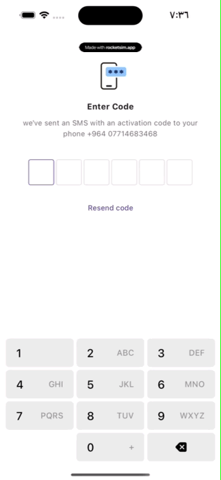

# kr_otp




OTP Input Package is a Flutter package that provides components for easy and customizable OTP input functionality in your Flutter applications.

# Table of Contents

- [kr\_otp](#kr_otp)
- [Table of Contents](#table-of-contents)
  - [Installation](#installation)
  - [Usage](#usage)
    - [Simple Usage](#simple-usage)
    - [Customizable Usage](#customizable-usage)
  - [Contributions and Issues](#contributions-and-issues)

## Installation

Add `kr_otp` to your `pubspec.yaml` file:

```yaml
dependencies:
  kr_otp: ^1.0.0
```

Run flutter pub get to install the package.

## Usage

### Simple Usage
To use the OTP input field with default settings, simply import the package and use the `OtpInputField` widget:

```dart
import 'package:flutter/material.dart';
import 'package:otp_input/otp_input.dart';

void main() {
  runApp(MyApp());
}

class MyApp extends StatelessWidget {
  @override
  Widget build(BuildContext context) {
    return MaterialApp(
      home: Scaffold(
        appBar: AppBar(
          title: Text('OTP Input Demo'),
        ),
        body: Column(
          children: [
            OtpInputField(
              onCodeSubmitted: (code) async {
                // Handle the submitted OTP code
                print('OTP Submitted: $code');
                // Return true if code is valid, false otherwise
                return true;
              },
            ),
            const Spacer(),
            KrOtpKeyboard(),
          ],
        ),
      ),
    );
  }
}

```

### Customizable Usage
You can customize the appearance and behavior of the OTP input field and keyboard by providing optional parameters to the widgets:

```dart
OtpInputField(
  onCodeSubmitted: (code) async {
    // Handle the submitted OTP code
    print('OTP Submitted: $code');
    // Return true if code is valid, false otherwise
    return true;
  },
  length: 6, // Length of the OTP code (default is 6)
  primaryColor: Colors.blue, // Color of the focused input field border
  buttonStyle: TextButton.styleFrom(
    backgroundColor: Colors.grey.shade200,
    shape: RoundedRectangleBorder(
      borderRadius: BorderRadius.circular(6),
    ),
    padding: EdgeInsets.symmetric(horizontal: 20),
    minimumSize: Size(0, 55),
  ),
  textStyle: TextStyle(color: Colors.black, fontSize: 22), // Style for OTP digits
);

KrOtpKeyboard(
  buttonColor: Colors.blue,
  buttonStyle: TextButton.styleFrom(
    backgroundColor: Colors.blue,
    foregroundColor: Colors.white,
    shape: RoundedRectangleBorder(
      borderRadius: BorderRadius.circular(10),
    ),
    padding: const EdgeInsets.all(20),
    minimumSize: const Size(60, 60),
  ),
  keyboardPadding: const EdgeInsets.symmetric(horizontal: 20),
  primaryTextStyle: const TextStyle(
    fontSize: 20,
    color: Colors.white,
    fontWeight: FontWeight.bold,
  ),
  secondaryTextStyle: const TextStyle(
    fontSize: 16,
    color: Colors.white54,
    fontWeight: FontWeight.normal,
  ),
),

```

## Contributions and Issues
Contributions and bug reports are welcome! Please feel free to open an issue or submit a pull request on the GitHub repository.